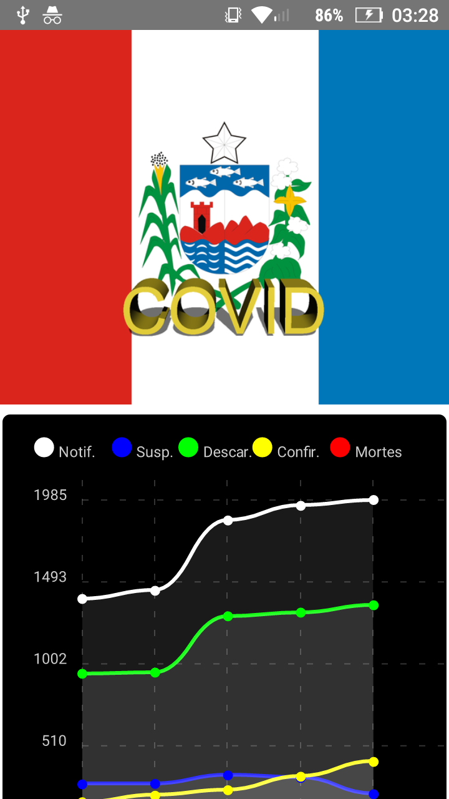

## Covid 19 AL app

This is a small ReactNative app which allow people to have a graphical view of the evolution of Covid 19 cases in State of Alagoas, Brazil.    


## Additional dependencies

* eslint and airbnb styles.
* react-native-chart-kit
* react-native-orientation-locker

## Instalation 

Clone the project
```
git clone https://github.com/nicolas-costa/covidal_app.git
```

Get into folder

```
cd covidal_app
```

Install dependencies
```
npm|yarn install
```

Make a .env file based off of the .env.example and change the API URL if necessary
 
 
 

## Screen



## License
WTFPL

## Credits
Nícolas Costa
